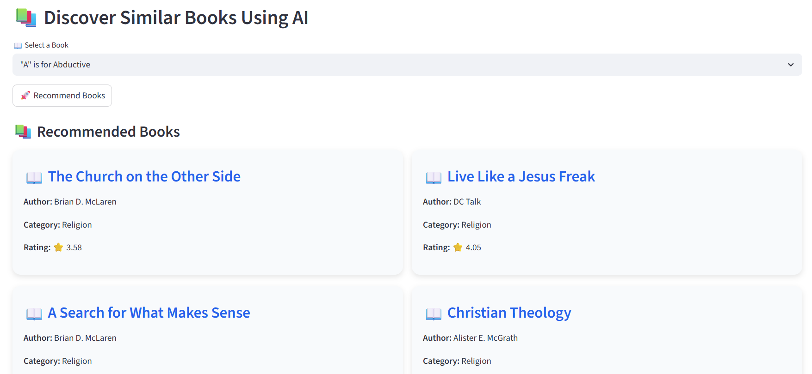
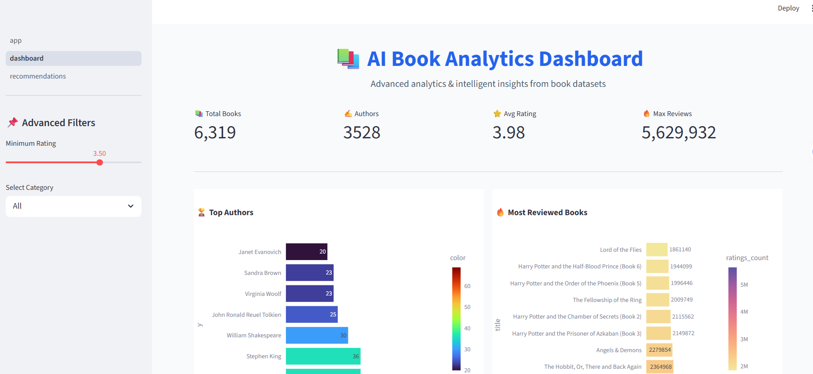

# Book-Recommendation-System
Content-based Book Recommendation System using Python, Streamlit, TF-IDF, and Cosine Similarity.

This project recommends books using content-based filtering with TF-IDF Vectorization and Cosine Similarity.

## Features
- Book recommendation system
- Search functionality
- Interactive dashboard
- Data visualization
- Rating analysis

## Technologies Used
- Python
- Streamlit
- Pandas
- Scikit-learn
- Plotly

## Project Screenshots

### Home Page

### Recommendation Output

### Dashboard

